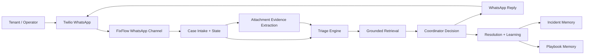
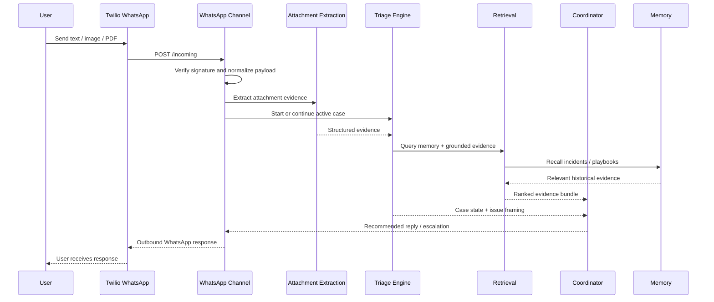
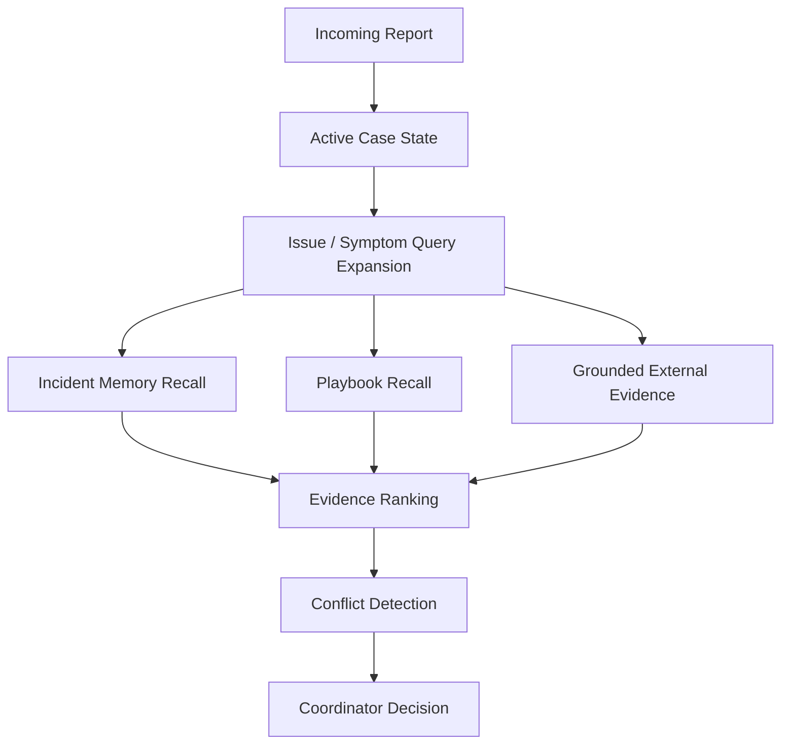
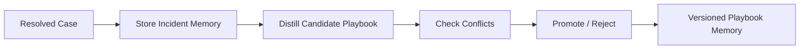

# Architecture

This document describes the product-facing architecture of FixFlow.

## System Overview

FixFlow uses WhatsApp as the operator interface and Gemma on Cerebras as the reasoning layer. Around that reasoning layer sits a structured workflow for evidence extraction, case-state management, grounded retrieval, and memory-backed learning.

## Core Layers

### 1. Channel Layer

The channel layer handles Twilio webhook verification, inbound normalization, outbound messaging, and media intake. This is the boundary between raw user traffic and the structured agent system.

### 2. Case Layer

The case layer maintains the active incident lifecycle. It tracks issue type, probable cause, confidence, stage, blockers, attachments, and the next action.

### 3. Evidence Layer

The evidence layer turns user-provided material into structured operational signal. Images, PDFs, and text-based attachments are normalized into evidence objects that the rest of the system can reason over.

### 4. Retrieval Layer

The retrieval layer combines multiple evidence sources instead of relying on a single RAG lookup. It uses active case context, long-term memory, and grounded sources to build a ranked evidence set.

### 5. Decision Layer

The decision layer produces the next best operational action: ask a follow-up question, recommend a field-safe action, escalate, or prepare dispatch-ready output.

### 6. Learning Layer

The learning layer stores resolved incidents, promotes reusable playbooks carefully, and preserves provenance so the system can improve without drifting.

## End-to-End Message Flow

## Retrieval and Memory Model

FixFlow is not designed as a vector-only RAG chatbot.

It uses three memory horizons:

- `Active session state`
  The live incident context for the ongoing conversation.
- `Incident memory`
  Historical resolved cases and supporting evidence.
- `Playbook memory`
  Reusable procedures promoted from repeated or trusted outcomes.

## Learning Loop

The learning system is designed to be governed rather than purely accumulative.

## Why This Architecture Works

- `Fast enough for operations`
  Cerebras keeps multi-step reasoning within the reply window.
- `Grounded enough for trust`
  Retrieval and evidence handling reduce unsupported answers.
- `Structured enough for enterprise use`
  The system behaves like a workflow engine, not just a chatbot.
- `Extensible enough for future channels`
  The same case, retrieval, and learning layers can support additional interfaces beyond WhatsApp.
